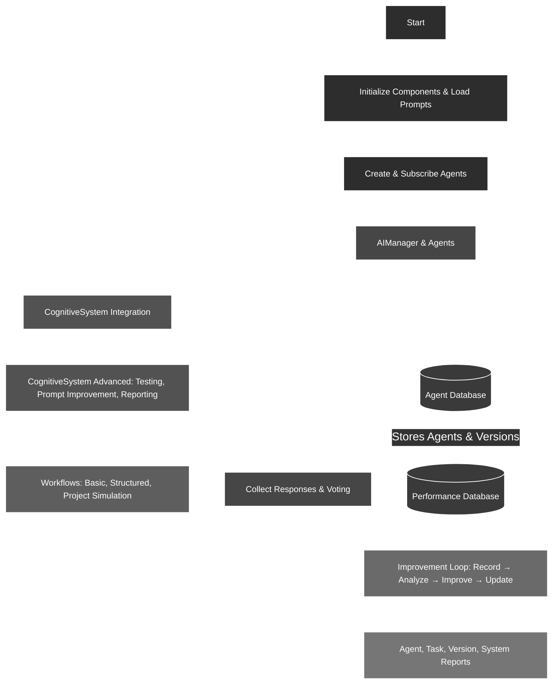

# About this summary
This is a summary of 'The Orchestrated Cognitive Perspectives' from AGPA, my fully autonomous general-purpose agent (closed-source, ~150k LOC).

### **The Orchestrated Cognitive Perspectives (OCP) System: A Detailed Write-Up (Revised)**

### **Executive Summary**

The Orchestrated Cognitive Perspectives (OCP) system is an advanced cognitive architecture designed to serve as a **reasoning multiplier**, strictly focused on complex problem-solving and decision-making. Developed to enhance a larger autonomous software development system, OCP functions not as a single AI, but as a "cognitive committee" or a simulated brain with specialized regions.

At its core, a central coordinating "Chief" module receives a cognitive task from the main application's LLM. The Chief then assembles a team of "Cognitive Modules" (referred to as agents), each with a highly specific focus such as strategic planning, rule-following (compliance), or creative thinking. These modules work in parallel to analyze the problem from their unique perspectives. The Chief synthesizes their feedback, resolves disagreements through a voting mechanism where it holds the tie-breaking vote, and returns a single, aggregated solution or plan. The system features dynamic, runtime creation of new modules to fill capability gaps and a data-driven self-improvement loop that refines underperforming modules, ensuring it adapts and improves over time.

---

### **1. The Problem Solved: From Monolithic AI to a "Cognitive Multiplier"**

Standard AI systems often rely on a single, general-purpose model. While powerful, this approach struggles with complex, multi-faceted problems that benefit from diverse, specialized viewpoints. It also lacks a transparent reasoning process, making it difficult to trust or debug.

The OCP system was designed to overcome these limitations and act as a "reasoning multiplier" for a larger autonomous system. The goal is not just to get an answer, but to arrive at a better, more robust answer by simulating a collaborative team of experts. It solves:

*   **Lack of Specialization:** Instead of one generalist, OCP uses a team of specialists (e.g., a "Sentinel" for rule-following, an "Innovator" for creativity), ensuring each facet of a problem is examined with focused expertise.
*   **Lack of Interpretability:** The system's output is a synthesis of multiple explicit inputs, and its entire reasoning process is logged, providing a clear "chain of thought."
*   **Static Capabilities:** The system can identify when a specific cognitive skill is missing and dynamically create a new module at runtime to fill that gap.
*   **Inefficiency:** It can leverage a mix of smaller, faster, and more cost-effective LLMs for specialist roles, reserving more powerful models for the crucial coordinating role of the Chief.

---

### **2. System Overview: A Brain with Specialized Regions**

The system is best understood as an analogy for the brain. The user is never directly aware of the OCP system's internal workings; they interact with the main application LLM. When that LLM needs to "think deeply" or solve a complex problem, it delegates to the OCP.

*   **The Main AI:** The LLM running the main application. It is the "human" in the analogy, making high-level decisions and interacting with the outside world (tools, UI).
*   **The Cognitive System (OCP):** This is the "brain" that the Main AI consults. It's a text-in, text-out system.
*   **The Chief Module:** This is the "executive function" of the brain. It's the only module aware of the overall goal and the other modules. It communicates with the Main AI and orchestrates the internal process.
*   **The Cognitive Modules (Agents):** These are the specialized "regions" of the brain (e.g., the part focused on logic, creativity, or risk assessment). **Crucially, they are not aware of each other.** They receive a task and context only from the Chief (via the controller) and return their specialized analysis, unaware that they are part of a larger team.

---

### **3. How It Works: The Flow of Thought**

A cognitive task unfolds in a clear, orchestrated sequence:

**Step 1: The Request**
The Main LLM running the application encounters a problem it needs to solve or a piece of output it needs to review. It passes a request to the Cognitive System.

**Step 2: Team Assembly**
The Chief receives the request. It analyzes the task and assembles a virtual "team" of cognitive modules best suited to handle it. If the Chief determines a necessary cognitive skill is missing (e.g., "geopolitical risk analysis"), it will dynamically generate a new module for that purpose (see Feature 4.1).

**Step 3: Parallel Processing**
The Chief (via the C# controller) passes the request and relevant context to each member of the assembled team. The modules work **in parallel**, each analyzing the problem through its own unique, highly focused prompt and "preoccupation" (e.g., rules, efficiency, creativity).

**Step 4: Synthesis and Iteration**
Each module provides its feedback to the Chief. The Chief then **aggregates and synthesizes** these diverse inputs into a single, coherent understanding. Based on this synthesis, it makes a decision:
*   **Return Solution:** If the feedback is sufficient, the Chief formulates the final solution and returns it to the Main LLM.
*   **Refine:** If the feedback has gaps or requires more detail, the Chief sends the request back to the team (or a subset of it) with a more refined focus for another cycle of processing.
 
---

### **4. Key Features and Innovations**

#### **4.1. Dynamic Module Creation at Runtime**

A cornerstone feature of OCP is its ability to adapt by creating new cognitive modules on the fly.

*   **Mechanism:** When the Chief identifies a missing capability needed to solve a problem, it issues a `[REQUEST_AGENT_CREATION]` directive. In this directive, the Chief itself acts as a prompt engineer, defining the new module's name, purpose, capabilities, and its entire system prompt.
*   **Impact:** This transforms the system from a static framework into a self-extending one. It can create custom "brain regions" tailored to novel problems, ensuring it is never limited by its initial set of cognitive functions.

#### **4.2. Data-Driven Self-Improvement**

The system is designed to learn from its performance and improve its own components over time.

*   **Mechanism:** After an interaction, the Chief's evaluation of each module's contribution is effectively a performance rating. This data (+/- feedback, comments on "big -" failures) is logged in the `AgentDatabase`. If a module's performance score drops below a certain threshold, the system flags it for review. It can then use the Chief in a meta-capacity to analyze the underperforming prompt and suggest or automatically apply refinements.
*   **Safety:** Every prompt change creates a **new version** in the database. The original is never lost. If an "improvement" results in worse performance, the system can simply revert to a previously known good version.
*   **Impact:** This creates a powerful, data-driven self-improvement loop. The system actively measures its own internal performance and uses its own reasoning capabilities to refine its components.

#### **4.3. Democratic Conflict Resolution**

In the event of a significant disagreement between modules where the Chief cannot easily synthesize a path forward, the system employs a democratic resolution process.

*   **Mechanism:** The conflicting options are presented to the team for a "vote." Each module provides its preference based on its own specialized focus. If the vote results in a tie, **the Chief acts as the deciding vote**, ensuring a decision is always reached and preventing deadlocks.
*   **Impact:** This leverages the collective perspective of the team to resolve high-stakes conflicts while maintaining the Chief's ultimate executive authority.

#### **4.4. Core Technical Components**

*   **`AIManager` & `AIAgent`:** C# classes managing the runtime lifecycle of cognitive modules and abstracting away the specifics of different LLM provider APIs.
*   **`AgentDatabase`:** A comprehensive SQLite database serving as the system's long-term memory, storing module definitions, prompt versions, performance metrics, interaction history, and team compositions.
*   **Model Agnosticism:** The system's plain-text-and-tags protocol ensures that any LLM (Claude, GPT, local models via LM Studio) can be used for any module, allowing for dynamic optimization of cost, speed, and capability for each cognitive role.

---

### **5. Conclusion: A Practical Path to Autonomous Reasoning**

The Orchestrated Cognitive Perspectives system provides a robust and practical framework for advanced AI reasoning. By structuring cognition as a collaborative process between specialized, focused modules under the guidance of a central orchestrator, it achieves a high degree of interpretability, flexibility, and power. Its ability to dynamically create and refine its own cognitive components makes it a truly adaptive system, designed not just to solve today's problems, but to evolve and improve to meet the challenges of tomorrow. It is, in essence, a "cognitive multiplier" that enhances the problem-solving capacity of any autonomous system it supports.

